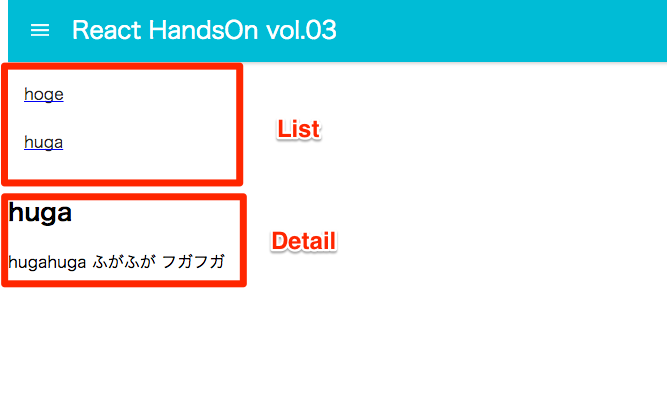

# React.js ハンズオン #3

ハンズオンのベースになるリポジトリです。このコードを修正していきます。

## 準備&動作確認

```
$ git clone https://github.com/mokumoku-temple/react-handson_vol03
$ npm install
$ npm start
```

`localhost:3000`にアクセスすると、下記のページが表示されます。ハンバーガーボタンを押すとメニューが表示されます。
このサンプルを、`react-router`を使いながらSPA（Single Page Application）化していきます。


## ハンズオン
### ページの追加
`Home`と`List`という2つのページをもつアプリケーションを作成します。

まずは、それぞれのページ用のjsファイルを作成します。

```
containers/home/index.js
containers/list/index.js
```

ファイル名には、一般的に`index.js`という名前がよく使われます。これは、importしたときに自動的にそのディレクトリ以下の`index.js`を読み込んでくれるためです。
なので、たとえば`containers/home/index.js`をimportするときは、

```js
import Home from './containers/home';
```

となります。

`home/index.js`と`list/index.js`は、次のようにします。JSXの部分は、ページの違いがわかれば何でも良いです。

#### containers/home/index.js

```js
import React, { Component } from 'react';

export default class HomePage extends Component {

  render() {
    return (
      <div>
        <h2>Home</h2>
      </div>
    );
  }
}
```

#### containers/list/index.js

```js
import React, { Component } from 'react';

export default class ListPage extends Component {

  render() {
    return (
      <div>
        <h2>List</h2>
      </div>
    );
  }
}
```

### 共通部分のコンポーネント

今回は、よくあるアプリケーションのように、ヘッダ部分はどのページでも同じものを表示します。
そのために、共通部分のコンポーネント`app/index.js`を作成します。
内容は、既存の`index.js`から、`MuiThemeProvider`省き、コンポーネントの最後に`{this.props.children}`を追加したものです。


#### containers/app/index.js

```js
import React, { Component } from 'react';

import AppBar from 'material-ui/AppBar';
import Drawer from 'material-ui/Drawer';
import MenuItem from 'material-ui/MenuItem';

export default class App extends Component {

  constructor(props) {
    super(props);

    this.state = {
      showMenu: false,
    };
  }

  onMenuStateChange(showMenu) {
    this.setState({ showMenu });
  }

  render() {
    return (
      <div>
        <AppBar
          title="React HandsOn vol.03"
          onLeftIconButtonTouchTap={() => this.onMenuStateChange(true)}
        />

        <Drawer
          docked={false}
          open={this.state.showMenu}
          width={200}
          onRequestChange={show => this.onMenuStateChange(show)}
        >
          <MenuItem>Home</MenuItem>
          <MenuItem>List</MenuItem>
        </Drawer>
        {/*ここまでヘッダ部分*/}

        {/*ここにページの要素が入る*/}
        {this.props.children}
      </div>
    );
  }
}
```

### ルーティングの設定

ルーティングに必要なモジュールと、先ほど作成したコンポーネントを読み込みます。

#### index.js

```js
import { Router, Route, IndexRoute, hashHistory } from 'react-router';

import App from './containers/app';
import Home from './containers/home';
import List from './containers/list';
```

ルートコンポーネントを次のように書き換えます。

```js
class Root extends Component {

  render() {
    return (
      <MuiThemeProvider>
        <Router history={hashHistory}>
          <Route path="/" component={App}>
            <IndexRoute component={Home} />

            <Route path="/list" component={List} />
          </Route>
        </Router>
      </MuiThemeProvider>
    );
  }
}
```

`react-router`で使うモジュールの概要。

| 名前 | 概要 |
| --- | --- |
| Router | このエレメントに含まれる部分が、ルーティングの対象になる |
| hashHistory | ブラウザの履歴管理をするモジュール |
| Route | 「このパスのときはこのコンポーネントを表示する」という定義 |
| IndexRoute | インデックスパス（`/`）へのアクセスのときに表示されるコンポーネントを指定 |

ここまでで、ルーティングの設定は完了です。次のURLにアクセスしてみましょう。

* `http://localhost:3000/#/`
* `http://localhost:3000/#/list`

### Linkの設定

ページ遷移用のリンク（HTMLで言うところの`href`）を作成します。
ヘッダのメニューにあるリストを、リンクに書き換えます。

#### containers/app/index.js

`import`を追加。

```js
import { Link } from 'react-router';
```

メニューを`<Link>`で囲む。

```js
<Link to="/"><MenuItem>Home</MenuItem></Link>
<Link to="/list"><MenuItem>List</MenuItem></Link>
```

これで、メニューをクリックするとページ遷移するはずです。
`href`を使って、自分でページ遷移を書くこともできなくはないですが、`react-router`を使っているうちは基本的に`<Link>`を使いましょう。

### ネストしたページ

説明し辛いのでとりあえず書きましょう。
作るのはこんな感じの`List - Detail`構成のページです。



本当はajaxとかでデータを取ってきたら良いのですが、難しそうなのでやめておきました。
Listのデータを別ファイルで定義して、読み込みます。コピペで良いです。

#### containers/list/items.js

```js
export default [
  {
    id: 1,
    title: 'hoge',
    contents: `
    hogehoge
    ほげほげ
    ホゲホゲ
    `,
  },
  {
    id: 2,
    title: 'huga',
    contents: `
    hugahuga
    ふがふが
    フガフガ
    `,
  },
];
```

次にリストページに、上で定義したアイテムを表示します。

#### containers/list/index.js

importを追加。

```js
import Items from './items';
```

JSX部分は以下のように修正します。長い所は、リストの内容をすべて表示する呪文です。

```js
export default class ListPage extends Component {
  render() {
    return (
      <div className="list">
        <List>
          {Items.map(item => <Link key={item.id} to={`/list/${item.id}`}><ListItem primaryText={item.title} /></Link>)}
        </List>

        {/*ここにdetailが表示される*/}
        {this.props.children}
      </div>
    );
  }
}
```

ここまでで、リストは表示されるようになりましたが、まだdetailを表示するルーティングを書いていないので、クリックしてもエラーが出ます。

### detailsの表示

詳細を表示する`details`コンポーネントを作成します。

#### containers/list/detail.js

```js
import React, { Component } from 'react';

import Items from './items';

export default class Detail extends Component {

  render() {
    // 何も選択されていないときの表示
    if (!this.props.params.id) {
      return (
        <div>リストから選択してください</div>
      );
    }

    // 表示するべきitemを探す（呪文）
    const item = Items.filter(i => i.id === +this.props.params.id)[0];

    return (
      <div>
        <h2>{item.title}</h2>
        <p>{item.contents}</p>
      </div>
    );
  }
}
```

次に、detailsを表示するためのルーティングを追記します。
`index.js`のListページのルーティングを次のように書き換えます。
pathで指定している`/:id`は、「任意の文字列を許容し、その文字列を`id`という名前のパラメータとしてコンポーネントが受け取る」という意味です。
先ほどの`detail`では、`this.props.params.id`という形で、渡されたidを受け取っています。

#### index.js

```js
<Route path="/list" component={List}>
  <IndexRoute component={Detail} />

  <Route path="/:id" component={Detail} />
</Route>
```

## Stack

* React
* Material-ui
* Webpack
* StyleLoader
